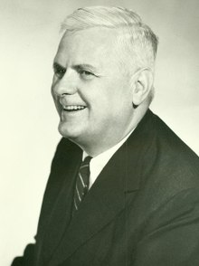

<h4 id="firstHeading" class="firstHeading" lang="en">Church&ndash;Turing thesis</h4> 

In&nbsp;<a class="mw-redirect" title="Computability theory (computation)" href="https://en.wikipedia.org/wiki/Computability_theory_(computation)">computability theory</a>, the&nbsp;<strong>Church&ndash;Turing thesis</strong>&nbsp;(also known as&nbsp;<strong>computability thesis</strong>,&nbsp;the&nbsp;<strong>Turing&ndash;Church thesis</strong>,&nbsp;the&nbsp;<strong>Church&ndash;Turing conjecture</strong>,&nbsp;<strong>Church's thesis</strong>,&nbsp;<strong>Church's conjecture</strong>, and&nbsp;<strong>Turing's thesis</strong>) is a&nbsp;<a title="Hypothesis" href="https://en.wikipedia.org/wiki/Hypothesis">hypothesis</a>&nbsp;about the nature of&nbsp;<a title="Computable function" href="https://en.wikipedia.org/wiki/Computable_function">computable functions</a>. It states that a&nbsp;<a title="Function (mathematics)" href="https://en.wikipedia.org/wiki/Function_(mathematics)">function</a>&nbsp;on the&nbsp;<a class="mw-redirect" title="Natural numbers" href="https://en.wikipedia.org/wiki/Natural_numbers">natural numbers</a>&nbsp;can be calculated by an&nbsp;<a title="Effective method" href="https://en.wikipedia.org/wiki/Effective_method">effective method</a>&nbsp;if and only if it is computable by a&nbsp;<a title="Turing machine" href="https://en.wikipedia.org/wiki/Turing_machine">Turing machine</a>. The thesis is named after American mathematician&nbsp;<a title="Alonzo Church" href="https://en.wikipedia.org/wiki/Alonzo_Church">Alonzo Church</a>&nbsp;and the British mathematician&nbsp;<a title="Alan Turing" href="https://en.wikipedia.org/wiki/Alan_Turing">Alan Turing</a>. Before the precise definition of computable function, mathematicians often used the informal term&nbsp;<a class="mw-redirect" title="Effectively calculable" href="https://en.wikipedia.org/wiki/Effectively_calculable">effectively calculable</a>&nbsp;to describe functions that are computable by paper-and-pencil methods. In the 1930s, several independent attempts were made to&nbsp;<a title="Formal system" href="https://en.wikipedia.org/wiki/Formal_system">formalize</a>&nbsp;the notion of&nbsp;<a title="Computability" href="https://en.wikipedia.org/wiki/Computability">computability</a>:

<ul>
<li>In 1933,&nbsp;<a title="Kurt G&ouml;del" href="https://en.wikipedia.org/wiki/Kurt_G%C3%B6del">Kurt G&ouml;del</a>, with&nbsp;<a title="Jacques Herbrand" href="https://en.wikipedia.org/wiki/Jacques_Herbrand">Jacques Herbrand</a>, created a formal definition of a class called&nbsp;<a title="General recursive function" href="https://en.wikipedia.org/wiki/General_recursive_function">general recursive functions</a>. The class of general recursive functions is the smallest class of functions (possibly with more than one argument) which includes all&nbsp;<a title="Constant function" href="https://en.wikipedia.org/wiki/Constant_function">constant functions</a>, projections, the&nbsp;<a title="Successor function" href="https://en.wikipedia.org/wiki/Successor_function">successor function</a>, and which is closed under&nbsp;<a title="Function composition" href="https://en.wikipedia.org/wiki/Function_composition">function composition</a>,&nbsp;<a title="Recursion" href="https://en.wikipedia.org/wiki/Recursion">recursion</a>, and&nbsp;<a title="&Mu; operator" href="https://en.wikipedia.org/wiki/%CE%9C_operator">minimization</a>.</li>
<li>In 1936,&nbsp;<a title="Alonzo Church" href="https://en.wikipedia.org/wiki/Alonzo_Church">Alonzo Church</a>&nbsp;created a method for defining functions called the&nbsp;<a title="Lambda calculus" href="https://en.wikipedia.org/wiki/Lambda_calculus">&lambda;-calculus</a>. Within &lambda;-calculus, he defined an encoding of the natural numbers called the&nbsp;<a class="mw-redirect" title="Church numerals" href="https://en.wikipedia.org/wiki/Church_numerals">Church numerals</a>. A function on the natural numbers is called&nbsp;<a class="mw-redirect" title="Lambda-recursive function" href="https://en.wikipedia.org/wiki/Lambda-recursive_function">&lambda;-computable</a>&nbsp;if the corresponding function on the Church numerals can be represented by a term of the &lambda;-calculus.</li>
<li>Also in 1936, before learning of Church's work,&nbsp;<a title="Alan Turing" href="https://en.wikipedia.org/wiki/Alan_Turing">Alan Turing</a>&nbsp;created a theoretical model for machines, now called Turing machines, that could carry out calculations from inputs by manipulating symbols on a tape. Given a suitable encoding of the natural numbers as sequences of symbols, a function on the natural numbers is called&nbsp;<a title="Computable function" href="https://en.wikipedia.org/wiki/Computable_function">Turing computable</a>&nbsp;if some Turing machine computes the corresponding function on encoded natural numbers.</li>
</ul>

Church&nbsp;and Turing&nbsp;proved that these three formally defined classes of computable functions coincide: a function is &lambda;-computable if and only if it is Turing computable, and if and only if it is&nbsp;<em>general recursive</em>. This has led mathematicians and computer scientists to believe that the concept of computability is accurately characterized by these three equivalent processes. Other formal attempts to characterize computability have subsequently strengthened this belief (see&nbsp;<a title="Church&ndash;Turing thesis" href="https://en.wikipedia.org/wiki/Church%E2%80%93Turing_thesis#Success_of_the_thesis">below</a>).

On the other hand, the Church&ndash;Turing thesis states that the above three formally-defined classes of computable functions coincide with the&nbsp;<em>informal</em>&nbsp;notion of an effectively calculable function. Since, as an informal notion, the concept of effective calculability does not have a formal definition, the thesis, although it has near-universal acceptance, cannot be formally proven.

Since its inception, variations on the original thesis have arisen, including statements about what can physically be realized by a computer in our universe (<a class="mw-redirect" title="Physical Church-Turing thesis" href="https://en.wikipedia.org/wiki/Physical_Church-Turing_thesis">physical Church-Turing thesis</a>) and what can be efficiently computed (<a href="https://en.wikipedia.org/wiki/Church%E2%80%93Turing_thesis#complexity-theoretic_Church%E2%80%93Turing_thesis">Church&ndash;Turing thesis (complexity theory)</a>). These variations are not due to Church or Turing, but arise from later work in&nbsp;<a title="Computational complexity theory" href="https://en.wikipedia.org/wiki/Computational_complexity_theory">complexity theory</a>&nbsp;and&nbsp;<a title="Digital physics" href="https://en.wikipedia.org/wiki/Digital_physics">digital physics</a>. The thesis also has implications for the&nbsp;<a title="Philosophy of mind" href="https://en.wikipedia.org/wiki/Philosophy_of_mind">philosophy of mind</a>.

&nbsp;

<table class="infobox biography vcard">
<tbody>
<tr>
<th colspan="2">

Alonzo Church

</th>
</tr>
<tr>
<td colspan="2">

Alonzo Church (1903&ndash;1995)

</td>
</tr>
<tr>
<th scope="row">Born</th>
<td>June 14, 1903 

<a title="Washington, D.C." href="https://en.wikipedia.org/wiki/Washington,_D.C.">Washington, D.C.</a>, US

</td>
</tr>
<tr>
<th scope="row">Died</th>
<td>August 11, 1995&nbsp;(aged&nbsp;92) 

<a title="Hudson, Ohio" href="https://en.wikipedia.org/wiki/Hudson,_Ohio">Hudson, Ohio</a>, US

</td>
</tr>
<tr>
<th scope="row">Nationality</th>
<td class="category">American</td>
</tr>
<tr>
<th scope="row">Alma&nbsp;mater</th>
<td><a title="Princeton University" href="https://en.wikipedia.org/wiki/Princeton_University">Princeton University</a></td>
</tr>
<tr>
<th scope="row">Known&nbsp;for</th>
<td><a title="Lambda calculus" href="https://en.wikipedia.org/wiki/Lambda_calculus">Lambda calculus</a> <a title="Simply typed lambda calculus" href="https://en.wikipedia.org/wiki/Simply_typed_lambda_calculus">Simply typed lambda calculus</a> <a title="Church encoding" href="https://en.wikipedia.org/wiki/Church_encoding">Church encoding</a> <a class="mw-redirect" title="Church's theorem" href="https://en.wikipedia.org/wiki/Church%27s_theorem">Church's theorem</a> <a title="Church&ndash;Kleene ordinal" href="https://en.wikipedia.org/wiki/Church%E2%80%93Kleene_ordinal">Church&ndash;Kleene ordinal</a> <a title="Church&ndash;Turing thesis" href="https://en.wikipedia.org/wiki/Church%E2%80%93Turing_thesis">Church&ndash;Turing thesis</a> <a title="Frege&ndash;Church ontology" href="https://en.wikipedia.org/wiki/Frege%E2%80%93Church_ontology">Frege&ndash;Church ontology</a> <a title="Church&ndash;Rosser theorem" href="https://en.wikipedia.org/wiki/Church%E2%80%93Rosser_theorem">Church&ndash;Rosser theorem</a> <a title="Intensional logic" href="https://en.wikipedia.org/wiki/Intensional_logic">Intensional logic</a></td>
</tr>
<tr>
<td colspan="2"><strong>Scientific career</strong></td>
</tr>
<tr>
<th scope="row">Fields</th>
<td class="category"><a title="Mathematics" href="https://en.wikipedia.org/wiki/Mathematics">Mathematics</a>,&nbsp;<a title="Logic" href="https://en.wikipedia.org/wiki/Logic">logic</a></td>
</tr>
<tr>
<th scope="row">Institutions</th>
<td><a title="Princeton University" href="https://en.wikipedia.org/wiki/Princeton_University">Princeton University</a>&nbsp;(1929&ndash;67) <a class="mw-redirect" title="UCLA" href="https://en.wikipedia.org/wiki/UCLA">UCLA</a>&nbsp;(1967&ndash;95)</td>
</tr>
<tr>
<th scope="row"><a title="Thesis" href="https://en.wikipedia.org/wiki/Thesis">Thesis</a></th>
<td><a class="external text" href="http://www.ams.org/journals/tran/1927-029-01/S0002-9947-1927-1501383-1/" rel="nofollow"><em>Alternatives to Zermelo's Assumption</em></a>&nbsp;(1927)</td>
</tr>
<tr>
<th scope="row"><a title="Doctoral advisor" href="https://en.wikipedia.org/wiki/Doctoral_advisor">Doctoral advisor</a></th>
<td><a title="Oswald Veblen" href="https://en.wikipedia.org/wiki/Oswald_Veblen">Oswald Veblen</a></td>
</tr>
<tr>
<th scope="row">Doctoral students</th>
<td><a title="C. Anthony Anderson" href="https://en.wikipedia.org/wiki/C._Anthony_Anderson">C. Anthony Anderson</a>&nbsp;1977 <a class="mw-redirect" title="Peter Andrews (mathematician)" href="https://en.wikipedia.org/wiki/Peter_Andrews_(mathematician)">Peter Andrews</a>&nbsp;1964 Bijan Arbab 1988 <a title="George Alfred Barnard" href="https://en.wikipedia.org/wiki/George_Alfred_Barnard">George Alfred Barnard</a>&nbsp;1936 James Bennett 1962 <a title="William Boone (mathematician)" href="https://en.wikipedia.org/wiki/William_Boone_(mathematician)">William W. Boone</a>&nbsp;1952 Enrique Bustamente-Llaca 1944 Edward Chapin 1970 Donald Collins 1967 Aubert Daigneault 1959 <a title="Martin Davis (mathematician)" href="https://en.wikipedia.org/wiki/Martin_Davis_(mathematician)">Martin Davis</a>&nbsp;1950 <a title="William Bigelow Easton" href="https://en.wikipedia.org/wiki/William_Bigelow_Easton">William Easton</a>&nbsp;1964 <a title="Alfred Foster (mathematician)" href="https://en.wikipedia.org/wiki/Alfred_Foster_(mathematician)">Alfred Foster</a>&nbsp;1930 James Guard 1961 <a title="Leon Henkin" href="https://en.wikipedia.org/wiki/Leon_Henkin">Leon Henkin</a>&nbsp;1947 Gustav Hensel 1963 <a title="David Kaplan (philosopher)" href="https://en.wikipedia.org/wiki/David_Kaplan_(philosopher)">David Kaplan</a> <a class="mw-redirect" title="John George Kemeny" href="https://en.wikipedia.org/wiki/John_George_Kemeny">John George Kemeny</a>&nbsp;1949 <a title="Stephen Cole Kleene" href="https://en.wikipedia.org/wiki/Stephen_Cole_Kleene">Stephen Cole Kleene</a>&nbsp;1934 <a title="Simon B. Kochen" href="https://en.wikipedia.org/wiki/Simon_B._Kochen">Simon B. Kochen</a>&nbsp;1959 <a title="Maurice L'Abb&eacute;" href="https://en.wikipedia.org/wiki/Maurice_L%27Abb%C3%A9">Maurice L'Abb&eacute;</a>&nbsp;1951 <a title="Isaac Malitz" href="https://en.wikipedia.org/wiki/Isaac_Malitz">Isaac (Richard) Malitz</a>&nbsp;1976 <a title="Gary R. Mar" href="https://en.wikipedia.org/wiki/Gary_R._Mar">Gary R. Mar</a>&nbsp;1985 Gerald Massey 1964 <a title="Michael O. Rabin" href="https://en.wikipedia.org/wiki/Michael_O._Rabin">Michael O. Rabin</a>&nbsp;1957 <a title="Nicholas Rescher" href="https://en.wikipedia.org/wiki/Nicholas_Rescher">Nicholas Rescher</a>&nbsp;1951 Wayne Richter 1963 Robert Ritchie 1960 <a class="new" title="Joel Robbin (page does not exist)" href="https://en.wikipedia.org/w/index.php?title=Joel_Robbin&amp;action=edit&amp;redlink=1">Joel Robbin</a>&nbsp;1965 <a class="mw-redirect" title="Hartley Rogers, Jr" href="https://en.wikipedia.org/wiki/Hartley_Rogers,_Jr">Hartley Rogers, Jr</a>&nbsp;1952 <a title="J. Barkley Rosser" href="https://en.wikipedia.org/wiki/J._Barkley_Rosser">J. Barkley Rosser</a>&nbsp;1934 <a title="Dana Scott" href="https://en.wikipedia.org/wiki/Dana_Scott">Dana Scott</a>&nbsp;1958 <a title="Norman Shapiro" href="https://en.wikipedia.org/wiki/Norman_Shapiro">Norman Shapiro</a>&nbsp;1955 <a title="Raymond Smullyan" href="https://en.wikipedia.org/wiki/Raymond_Smullyan">Raymond Smullyan</a>&nbsp;1959 <a title="Alan Turing" href="https://en.wikipedia.org/wiki/Alan_Turing">Alan Turing</a>&nbsp;1938 Robert Winder 1962</td>
</tr>
</tbody>
</table>
 
<table class="infobox biography vcard">
<tbody>
<tr>
<th colspan="2">

Alan Turing

 

<a class="mw-redirect" title="Officer of the Order of the British Empire" href="https://en.wikipedia.org/wiki/Officer_of_the_Order_of_the_British_Empire">OBE</a>&nbsp;<a title="Fellow of the Royal Society" href="https://en.wikipedia.org/wiki/Fellow_of_the_Royal_Society">FRS</a>

</th>
</tr>
<tr>
<td colspan="2">

Turing&nbsp;<abbr title="circa">c.</abbr>&nbsp;1928 at age 16

</td>
</tr>
<tr>
<th scope="row">Born</th>
<td>

Alan Mathison Turing

 23 June 1912 

<a title="Maida Vale" href="https://en.wikipedia.org/wiki/Maida_Vale">Maida Vale</a>, London, United Kingdom

</td>
</tr>
<tr>
<th scope="row">Died</th>
<td>7 June 1954&nbsp;(aged&nbsp;41) 

<a title="Wilmslow" href="https://en.wikipedia.org/wiki/Wilmslow">Wilmslow</a>, Cheshire, United Kingdom

</td>
</tr>
<tr>
<th scope="row">Cause&nbsp;of death</th>
<td>Suicide (disputed) by&nbsp;<a title="Cyanide poisoning" href="https://en.wikipedia.org/wiki/Cyanide_poisoning">cyanide poisoning</a></td>
</tr>
<tr>
<th scope="row">Resting place</th>
<td class="label">Ashes scattered in gardens of&nbsp;<a title="Woking Crematorium" href="https://en.wikipedia.org/wiki/Woking_Crematorium">Woking Crematorium</a></td>
</tr>
<tr>
<th scope="row">Nationality</th>
<td class="category">English</td>
</tr>
<tr>
<th scope="row">Education</th>
<td><a title="Sherborne School" href="https://en.wikipedia.org/wiki/Sherborne_School">Sherborne School</a></td>
</tr>
<tr>
<th scope="row">Alma&nbsp;mater</th>
<td>

<ul>
<li><a title="University of Cambridge" href="https://en.wikipedia.org/wiki/University_of_Cambridge">University of Cambridge</a>&nbsp;(<a title="Bachelor of Arts" href="https://en.wikipedia.org/wiki/Bachelor_of_Arts">BA</a>,&nbsp;<a title="Master of Arts" href="https://en.wikipedia.org/wiki/Master_of_Arts">MA</a>)</li>
<li><a title="Princeton University" href="https://en.wikipedia.org/wiki/Princeton_University">Princeton University</a>&nbsp;(PhD)</li>
</ul>

</td>
</tr>
<tr>
<th scope="row">Known&nbsp;for</th>
<td>

<ul>
<li><a title="Cryptanalysis of the Enigma" href="https://en.wikipedia.org/wiki/Cryptanalysis_of_the_Enigma">Cryptanalysis of the Enigma</a></li>
<li><a title="Turing's proof" href="https://en.wikipedia.org/wiki/Turing%27s_proof">Turing's proof</a></li>
<li><a title="Turing machine" href="https://en.wikipedia.org/wiki/Turing_machine">Turing machine</a></li>
<li><a title="Turing test" href="https://en.wikipedia.org/wiki/Turing_test">Turing test</a></li>
<li><a title="Unorganized machine" href="https://en.wikipedia.org/wiki/Unorganized_machine">Unorganised machine</a></li>
<li><a title="Turing pattern" href="https://en.wikipedia.org/wiki/Turing_pattern">Turing pattern</a></li>
<li><a title="Turing reduction" href="https://en.wikipedia.org/wiki/Turing_reduction">Turing reduction</a></li>
<li><a title="The Chemical Basis of Morphogenesis" href="https://en.wikipedia.org/wiki/The_Chemical_Basis_of_Morphogenesis">The Chemical Basis of Morphogenesis</a></li>
</ul>

</td>
</tr>
<tr>
<th scope="row">Partner(s)</th>
<td><a title="Joan Clarke" href="https://en.wikipedia.org/wiki/Joan_Clarke">Joan Clarke</a> (engaged in 1941; did not marry)</td>
</tr>
<tr>
<th scope="row">Awards</th>
<td><a title="Smith's Prize" href="https://en.wikipedia.org/wiki/Smith%27s_Prize">Smith's Prize</a>&nbsp;(1936)</td>
</tr>
<tr>
<td colspan="2"><strong>Scientific career</strong></td>
</tr>
<tr>
<th scope="row">Fields</th>
<td class="category">

<ul>
<li><a title="Logic" href="https://en.wikipedia.org/wiki/Logic">Logic</a></li>
<li>Mathematics</li>
<li><a title="Cryptanalysis" href="https://en.wikipedia.org/wiki/Cryptanalysis">Cryptanalysis</a></li>
<li><a title="Computer science" href="https://en.wikipedia.org/wiki/Computer_science">Computer science</a></li>
<li><a title="Mathematical and theoretical biology" href="https://en.wikipedia.org/wiki/Mathematical_and_theoretical_biology">Mathematical and theoretical biology</a></li>
</ul>

</td>
</tr>
<tr>
<th scope="row">Institutions</th>
<td>

<ul>
<li><a title="University of Manchester" href="https://en.wikipedia.org/wiki/University_of_Manchester">University of Manchester</a></li>
<li><a class="mw-redirect" title="Government Code and Cypher School" href="https://en.wikipedia.org/wiki/Government_Code_and_Cypher_School">Government Code and Cypher School</a></li>
<li><a class="mw-redirect" title="National Physical Laboratory, UK" href="https://en.wikipedia.org/wiki/National_Physical_Laboratory,_UK">National Physical Laboratory</a></li>
</ul>

</td>
</tr>
<tr>
<th scope="row"><a title="Thesis" href="https://en.wikipedia.org/wiki/Thesis">Thesis</a></th>
<td><a class="external text" href="Turing_1939_Sysyems.pdf" rel="nofollow"><em>Systems of Logic Based on Ordinals</em></a>&nbsp;(1938)</td>
</tr>
<tr>
<th scope="row"><a title="" href="https://en.wikipedia.org/wiki/Doctoral_advisor">Doctoral advisor</a></th>
<td><a title="Alonzo Church" href="https://en.wikipedia.org/wiki/Alonzo_Church">Alonzo Church</a></td>
</tr>
<tr>
<th scope="row">Doctoral students</th>
<td><a title="Robin Gandy" href="https://en.wikipedia.org/wiki/Robin_Gandy">Robin Gandy</a>,&nbsp;<a title="Beatrice Worsley" href="https://en.wikipedia.org/wiki/Beatrice_Worsley">Beatrice Worsley</a></td>
</tr>
<tr>
<th scope="row">Influences</th>
<td><a title="Max Newman" href="https://en.wikipedia.org/wiki/Max_Newman">Max Newman</a></td>
</tr>
<tr>
<th colspan="2">Signature</th>
</tr>
<tr>
<td colspan="2"></td>
</tr>
</tbody>
</table>
 
<h2> Papers </h2>

<ul>

                             

 <li><a target="_blank" href="https://github.com/manjunath5496/Church-Turing-Thesis-Research-Papers/blob/master/ctt(1).pdf" style="text-decoration:none;">Computationalism, The Church–Turing Thesis, and the Church–Turing Fallacy</a></li>

 <li><a target="_blank" href="https://github.com/manjunath5496/Church-Turing-Thesis-Research-Papers/blob/master/ctt(2).pdf" style="text-decoration:none;">Did Church and Turing Have a Thesis about Machines?</a></li>

<li><a target="_blank" href="https://github.com/manjunath5496/Church-Turing-Thesis-Research-Papers/blob/master/ctt(3).pdf" style="text-decoration:none;">Church's Thesis after 70 Years</a></li>
 <li><a target="_blank" href="https://github.com/manjunath5496/Church-Turing-Thesis-Research-Papers/blob/master/ctt(4).pdf" style="text-decoration:none;">Gödel on Turing on Computability</a></li>                              
<li><a target="_blank" href="https://github.com/manjunath5496/Church-Turing-Thesis-Research-Papers/blob/master/ctt(5).pdf" style="text-decoration:none;">On Computable Numbers, with an Application to the Entscheidungsproblem</a></li>
<li><a target="_blank" href="https://github.com/manjunath5496/Church-Turing-Thesis-Research-Papers/blob/master/ctt(6).pdf" style="text-decoration:none;">Turing Oracle Machines, Online Computing, and Three Displacements in Computability Theory</a></li>
 <li><a target="_blank" href="https://github.com/manjunath5496/Church-Turing-Thesis-Research-Papers/blob/master/ctt(7).pdf" style="text-decoration:none;">Systems of Logic Based on Ordinals</a></li>

 <li><a target="_blank" href="https://github.com/manjunath5496/Church-Turing-Thesis-Research-Papers/blob/master/ctt(8).pdf" style="text-decoration:none;"> Algorithms: A Quest for Absolute Definitions</a></li>
</ul>
  
